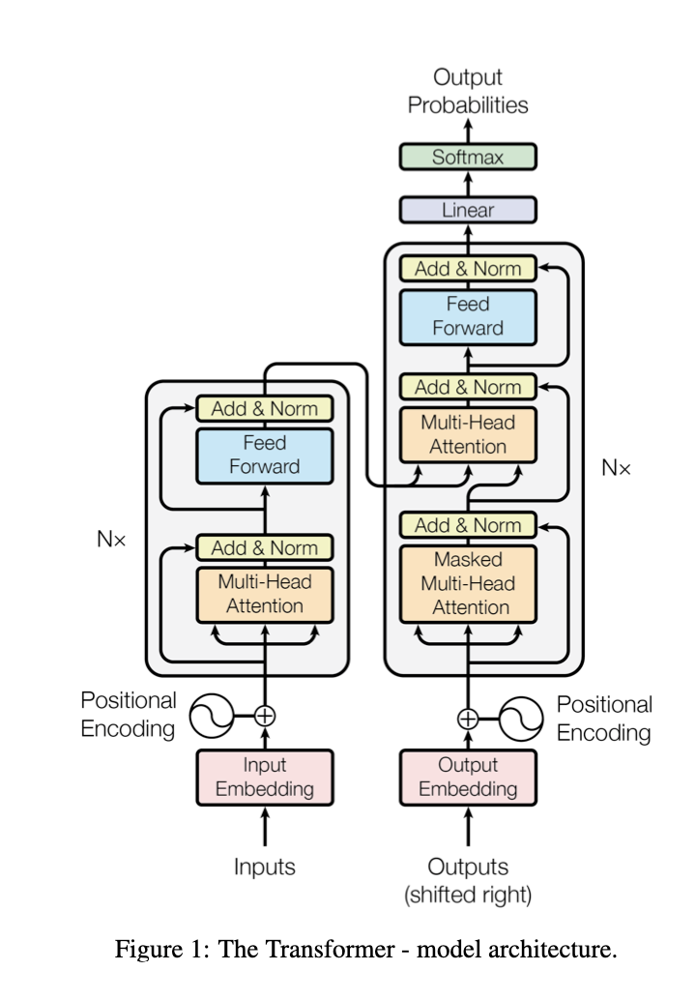
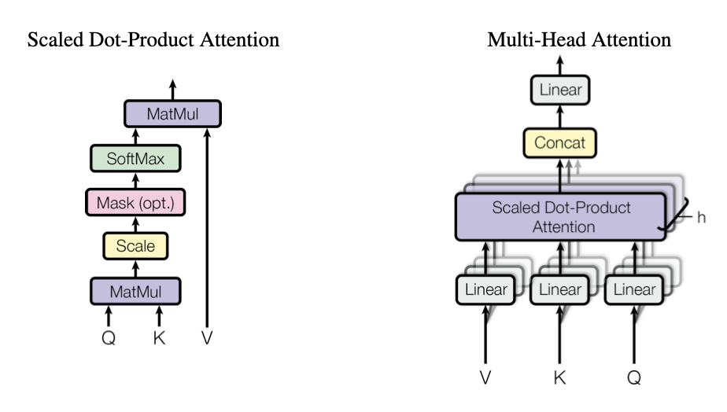

# transformer_scratch
Study the background of transformer design

# Transformer (Encoder + Decoder)

    

# Mutti-Head Mechanism

    

# Todo
- Play around with tensor/matrix calculation (gpu vs cpu)